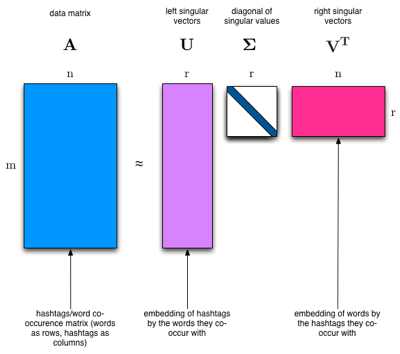
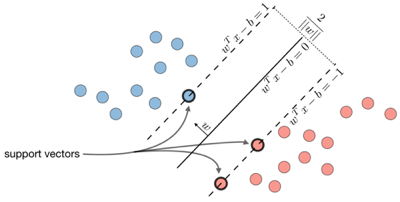

# Machine learning algorithms For Student

## Getting Started
Implementation of Machine Learning Algorithms Step by Step

## Usage
Run exmaple_*.py under examples/ folder

## Mathematics and Python for Machine Learning
* [Python classes](./ml_math/python_class.py)
* [Singular value decomposition](./ml_math/singular_value_decomposition.py)
## Algorithms
### Getting started
* [Simple Linear Regression](./ml_student/simple_linear_regression/simple_linear_regression.py) | [Example](./examples/example_SimpleLinearRegression.py)

### Supervised Learning
### [Regression](./ml_student/regression/regression.py)

| | Linear Regression | Lasso Regression | Ridge Regression |
| --- | --- | --- | --- |
| Loss function | Least squared error | L1 regularization| L2 regularization |
| Core | SVD | Coordinate descent | Gradient descent |
| Images |  | |
| Examples | [One-dimensional Linear Regression](./examples/example_LinearRegression.py) | [Lasso Regression](./examples/example_LassoRegression.py)| [Ridge Regression](./examples/example_RidgeRegression.py) |

---

### [Support Vector Machine](./ml_student/support_vector_machine/support_vector_machine.py)

| | Description |
| ------ | ----------- |
| Core | SMO, Kernel |
| Images |  |
| Examples | [Support Vector Machine](./examples/example_svm.py) |

---

### [Decision Trees](./ml_student/decision_tree/decision_tree.py)

| | Classification Tree | RegressionTree |
| -- | --- | --- |
| Split | Information gain | Variance reduction |
| Predict | Majority vote | Mean of Y |
| Examples | [Example - Classification Tree](./examples/example_ct.py) | [Example - Regression Tree](./examples/example_rt.py) |

---

* [Logistic Regression](./ml_student/logistic_regression/logistic_regression.py)
  * [Example](./examples/example_logit.py)
* [k Nearest Neighbors](./ml_student/k_nearest_neighbors/k_nearest_neighbors.py)
  * [Example](./examples/example_knn.py)
* [Principal Component Analysis](./ml_student/linear_discriminant_analysis/linear_discriminant_analysis.py)
  * [Example](./examples/example_lda.py)

### Unsupervised Learning
* [Linear Discriminant Analysis](./ml_student/principal_component_analysis/principal_component_analysis.py)
  * [Example](./examples/example_pca.py)

### Reinforcement Learning
* in progress...

### Deep Learning
* [Back Propagation](./ml_student/back_propagation/back_propagation.py)
  * [Example](./examples/example_bp.py)