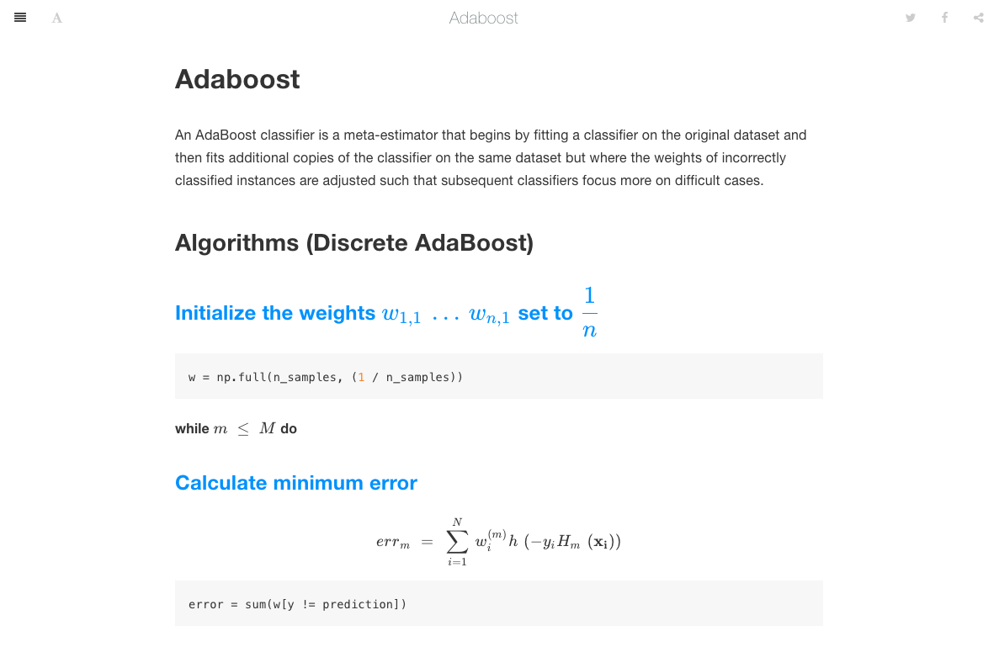

# Alphalearn


Write machine learning algorithms from zero for self-learning. All algorithm codes are implemented in Python with friendly comments and easier to understand how they works.

## Installation
```
git clone https://github.com/byzhi/alphalearn
cd alphalearn
pip install -e .
```

## Usage
```python
from alphalearn.api import LinearRegression
model = LinearRegression()
model.fit(X, y)
```

## Document
[docs](https://byzhi.github.io/alphalearn/)



## Algorithms

### Supervised Learning
Linear models

- Logistic Regression [code](./alphalearn/supervised/logistic_regression.py), [example](./examples/example_LogisticRegression.py)
- Regression [code](./alphalearn/supervised/regression.py), examples: [Linear](./examples/example_LinearRegression.py)
, [Lasso](./examples/example_LassoRegression.py)
, [Ridge](./examples/example_RidgeRegression.py)
, [Polynomial ridge](./examples/example_PolynomialRidgeRegression.py)

Classification

- Linear Discriminant Analysis [code](./alphalearn/supervised/linear_discriminant_analysis.py), [example](./examples/example_PCA_LDA.py)
- k-Nearest Neighbors [code](./alphalearn/supervised/k_nearest_neighbors.py), [example](./examples/example_KNeighborsClassifier.py)
- Perceptron [code](./alphalearn/supervised/perceptron.py), [example](./examples/example_Perceptron.py)
- Support Vector Machine [code](./alphalearn/supervised/support_vector_machine.py), examples: [01](./examples/example_svm.py), [02](./examples/example_svm_02.py)

Tree-based and ensemble methods

- Adaboost [code](./alphalearn/supervised/adaboost.py), [example](./examples/example_Adaboost.py)
- Decision Tree [code](./alphalearn/supervised/decision_tree.py), examples: [Classification tree](./examples/example_ClassificationTree.py), [Regression tree](./examples/example_RegressionTree.py)
- Gradient boosting [code](./alphalearn/supervised/gradient_boosting.py), examples: [GradientBoosting classifier](./examples/example_GradientBoostingClassifier.py), [GradientBoosting regressor](./examples/example_GradientBoostingRegressor.py)
- Random forests [code](./alphalearn/supervised/random_forest.py), [example](./examples/example_RandomForestClassifier.py)
- XGBoost [code](./alphalearn/supervised/xgboost.py), [example](./examples/example_XGBoost.py)

Generative Learning

- Naive Bayes [code](./alphalearn/supervised/naive_bayes.py), [example](./examples/example_GaussianNB.py)

### Unsupervised Learning

Dimension reduction

- K-Means [code](./alphalearn/unsupervised/kmeans.py), [example](./examples/example_KMeans.py)
- Principal Component Analysis [code](./alphalearn/unsupervised/principal_component_analysis.py), [example](./examples/example_PCA_LDA.py)


### Reinforcement Learning
- Q-learning [code](./alphalearn/reinforcement/qlsarsa/base.py), [example](./examples/example_QLearning.py)
- SARSA [code](./alphalearn/reinforcement/qlsarsa/base.py), [example](./examples/example_SARSA.py)
- DQN (Deep Q Network) [code](./alphalearn/reinforcement/dqn/DeepQNetwork.py), [example](./examples/example_DeepQNetwork.py)

### Deep Learning
- DNN
- RNN
- CNN [example](./examples/example_CNN.py)

## Reference
- [ML-From-Scratch](https://github.com/eriklindernoren/ML-From-Scratch)
- [Lasso](https://github.com/satopirka/Lasso)
- [Implementing a Principal Component Analysis (PCA)](https://sebastianraschka.com/Articles/2014_pca_step_by_step.html)
- [Linear Discriminant Analysis Bit by Bit](https://sebastianraschka.com/Articles/2014_python_lda.html)
- [Reinforcement Learning](https://github.com/rlcode/reinforcement-learning)