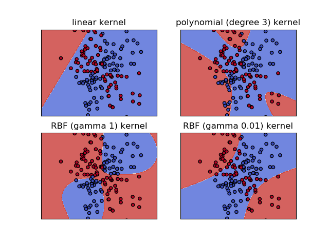
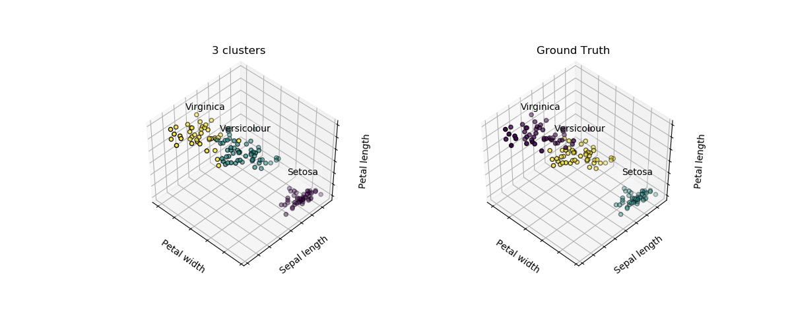

# alphalearn
write machine learning algorithms from for self-learning


## Installation
```bash
git clone https://github.com/byzhi/alphalearn
pip install -e .
```

## Usage
```python
from alphalearn.api import LinearRegression
model = LinearRegression()
model.fit(X, y)

X = np.array([[1, 1], [1, 2], [2, 2], [2, 3]])
y = np.dot(X, np.array([1, 2])) + 3
X_test = np.array([[3, 5]])

y_pred = model.predict(X_test)
```

## Document
[docs](https://byzhi.github.io/alphalearn/) 

## Table of Contents

### Supervised Learning
linear models

- [Logistic Regression](./alphalearn/supervised/logistic_regression.py)
- [Regression](./alphalearn/supervised/regression.py)

classification

- [Linear Discriminant Analysis](./alphalearn/supervised/linear_discriminant_analysis.py)
- [k-Nearest Neighbors](./alphalearn/supervised/k_nearest_neighbors.py)
- [Perceptron](./alphalearn/supervised/perceptron.py)
- [Support Vector Machine](./alphalearn/supervised/support_vector_machine.py)

tree-based and ensemble methods

- [Adaboost](./alphalearn/supervised/adaboost.py)
- [Decision Tree](./alphalearn/supervised/decision_tree.py)
- [Gradient boosting](./alphalearn/supervised/gradient_boosting.py)
- [Random forests](./alphalearn/supervised/random_forest.py)
- [XGBoost](./alphalearn/supervised/xgboost.py)

generative Learning

- [Naive Bayes](./alphalearn/supervised/naive_bayes.py)

### Unsupervised Learning

dimension reduction

- [K-Means](./alphalearn/unsupervised/kmeans.py)
- [Principal Component Analysis](./alphalearn/unsupervised/principal_component_analysis.py)
-  FP-Growth

### Reinforcement Learning
- [Q-learning](./alphalearn/reinforcement/ql/q_learning.py)
- DQN (Deep Q Network)
- SARSA

### Deep Learning
- DNN
- RNN
- CNN

## Examples
#### Supervised Learning

linear models
- [Logistic Regression](./examples/example_LogisticRegression.py)
- [Linear regression](./examples/example_LinearRegression.py)
, [Lasso](./examples/example_LassoRegression.py)
, [Ridge](./examples/example_RidgeRegression.py)
, [Polynomial ridge regression](./examples/example_PolynomialRidgeRegression.py)

classification
- [LDA](./examples/example_PCA_LDA.py)
- [KNN](./examples/example_KNeighborsClassifier.py)
- [Perceptron](./examples/example_Perceptron.py)
- [SVM 01](./examples/example_svm.py), [02](./examples/example_svm_02.py)



tree-based and ensemble methods
- [Adaboost](./examples/example_Adaboost.py)
- [Classification tree](./examples/example_ClassificationTree.py), [Regression tree](./examples/example_RegressionTree.py)
- [GradientBoostingclassifier](./examples/example_GradientBoostingClassifier.py), [GradientBoostingregressor](./examples/example_GradientBoostingRegressor.py)
- [Random Forest](./examples/example_RandomForestClassifier.py)
- [XGBoost](./examples/example_XGBoost.py)

generative Learning
- [Naive Bayes](./examples/example_GaussianNB.py)


#### Unsupervised Learning
- [PCA](./examples/example_PCA_LDA.py)
- [K-Means](./examples/example_KMeans.py)


#### Reinforcement Learning
- [Q-learning](./examples/example_QLearning.py)

## Reference
- [ML-From-Scratch](https://github.com/eriklindernoren/ML-From-Scratch)
- [Lasso](https://github.com/satopirka/Lasso)
- [Implementing a Principal Component Analysis (PCA)](https://sebastianraschka.com/Articles/2014_pca_step_by_step.html)
- [Linear Discriminant Analysis Bit by Bit](https://sebastianraschka.com/Articles/2014_python_lda.html)
- [Reinforcement Learning](https://github.com/rlcode/reinforcement-learning)