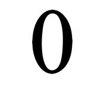

<div align="center">



# zero
**Write machine learning algorithms from Zero**


</div>

## Features
- Friendly code and document.
- Minimal implementation from Zero.
- Designed for easily learning algorithms.

## Getting started
Linear regression demo.
```python
from zero.api import LinearRegression
model = LinearRegression()
model.fit(X, y)
```

## Document
[](https://byzhi.github.io/zero/) here.

## Algorithms

### Supervised Learning
<p style="color:#959da5;">linear models</p>

- [**Regression**](./zero/supervised/regression.py)
  | [Linear Example](./examples/example_LinearRegression.py)
  | [Lasso Example](./examples/example_LassoRegression.py)
  | [Ridge Example](./examples/example_RidgeRegression.py)
  | [Polynomial Ridge Example](./examples/example_PolynomialRidgeRegression.py)
- [**Logistic Regression**](./zero/supervised/logistic_regression.py) | [Example](./examples/example_LogisticRegression.py)

<p style="color:#959da5;">classification</p>

- Perceptron
- [**Support Vector Machine**](./zero/supervised/support_vector_machine.py) | [Example 01](./examples/example_svm.py) | [Example 02](./examples/example_svm_02.py)
- k-nearest neighbor
- [**Linear Discriminant Analysis**](./zero/supervised/linear_discriminant_analysis.py) | [Example](./examples/example_PCA_LDA.py)
- Naive Bayes

<p style="color:#959da5;">trees</p>

- [**Classification Tree**](./zero/supervised/decision_tree.py) | [Example](./examples/example_ClassificationTree.py)
- [**RegressionTree**](./zero/supervised/decision_tree.py) | [Example](./examples/example_RegressionTree.py)
- Random forests

<p style="color:#959da5;">ensemble methods</p>

- [**Adaboost**](./zero/supervised/adaboost.py) | [Example](./examples/example_Adaboost.py)
- Gradient boosting
- XGBoost

### Unsupervised Learning

<p style="color:#959da5;">dimension reduction</p>

-  [**Principal Component Analysis**](./zero/unsupervised/principal_component_analysis.py) | [Example](./examples/example_PCA_LDA.py)
-  K-Means
-  FP-Growth

### Reinforcement Learning
- Q-learning

### Deep Learning
- DNN
- RNN
- CNN
