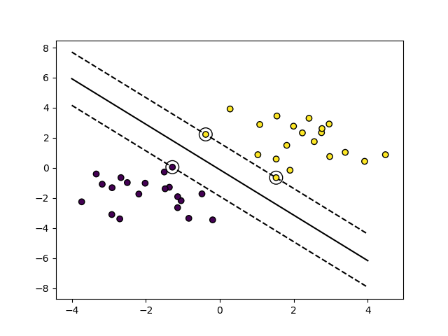

# Zero: Machine learning algorithms for learning

## Table of contents
- [Math in Python](#Math-in-Python)
- [Support Vector Machine](#Support-Vector-Machine)

### Math in Python
- [Singular value decomposition(SVD)](./docs/singular_value_decomposition.py)
- [Quadratic program](./docs/quadratic_program.py)
- [Classes](./docs/python_class.py)
- [Numpy](./docs/python_numpy.py)

### Linear regression
$${\theta=(X^TX)^{-1}X^Ty}$$
- step 1 insert 1 in first column, X . X^T
- step 2 SVD(X . X^T)
- step 3 weight = svd(X . X^T) . X^T . y

[top](#Table-of-contents)

### LassoRegression
- initial $\beta$，λ fixed
- if fit_intercept, update $\beta_0$
- while true:
  - for j in len($\beta$), update $\beta_j$ = Soft-thresholding operator() / X . X^T
  - if fit_intercept, update $\beta_0$

[top](#Table-of-contents)

### Support Vector Machine
| Advantages | Disadvantages |
|---|---|
| effective in high dimensional | if features > samples, avoid over-fitting is crucial |
| memory efficient| do not directly provide probability estimates |
| versatile: different Kernel functions |  |

* Step 1 Solve quadratic program
* Step 2 Get index when solution > tol
* Step 3 Get Lagrange multipliers, support vectors(X[index]), support vector labels(y[index])
* Step 4 coef and intercept
  * coef = intercept - sum(alpha * X * y)
  * intercept = support vector labels - (support vectors . coef)

[top](#Table-of-contents)

